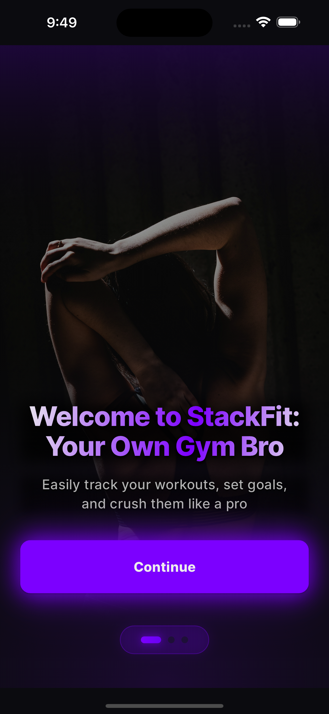
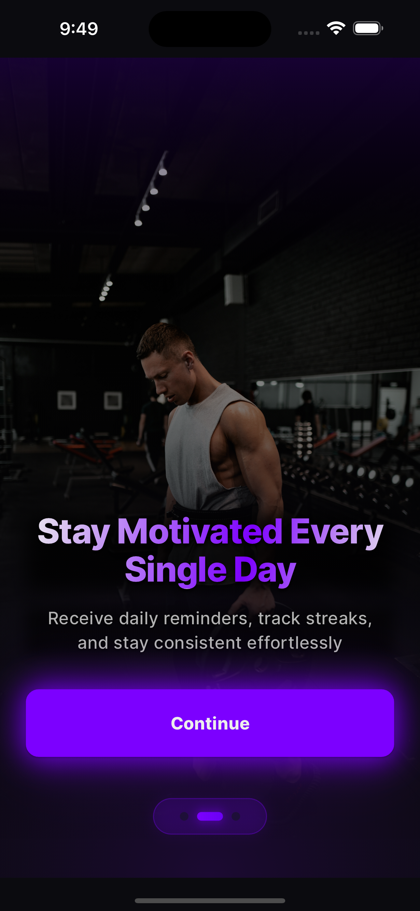
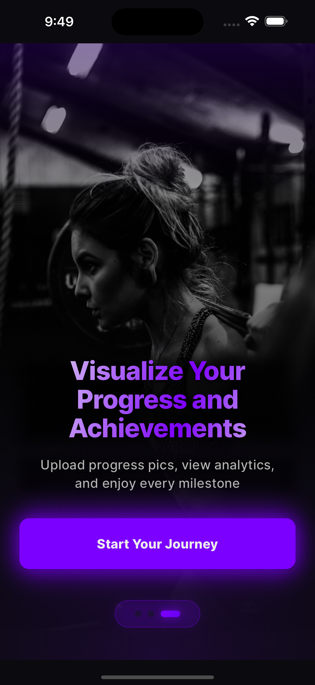

# 📱 StackFit — Flutter

Welcome to the Flutter frontend for **StackFit**, your all-in-one smart gym tracker.  
Track your workouts, crush your goals, and build consistency — one rep at a time.

---

## 🛠️ Built With

- 💙 Flutter (clean architecture)
- 🧠 Riverpod (state management)
- 🧭 go_router (navigation)
- 🧪 Hive/Isar (local DB)
- 📦 GraphQL Client
- ✨ Animations with flutter_animate
- 📱 Responsive design (mobile-first)

---

## ⚙️ Features

- 🔐 User authentication (JWT-based)
- 📅 Daily workout logging
- 📈 Streak & history tracking
- 🤖 Smart workout suggestions (premium)
- 📷 Media uploads (progress tracking)
- 💤 Custom gym off-days
- 💎 Subscription-based premium features (via in-app purchases)

---

## 📸 App Preview

Here’s a sneak peek at the **onboarding flow** 👇

<p align="center">
  
  
  
</p>

---

## 🚀 Getting Started

### 1. Clone the repo
```bash
git clone https://github.com/deekshaxcommits/stackfit-flutter.git
cd stack-fit-flutter

```

## 🎯 Upcoming

- Dark mode support  
- Offline syncing  
- Push notification reminders  
- AI-based personalized workout plans

---

## 🤍 Author

Made with commits, caffeine & no sleep ☕  
[@coffeeandcommits](https://x.com/deekshaxcommits)

---

## 📄 License

MIT © [coffeeandcommits](https://github.com/deekshaxcommits)
